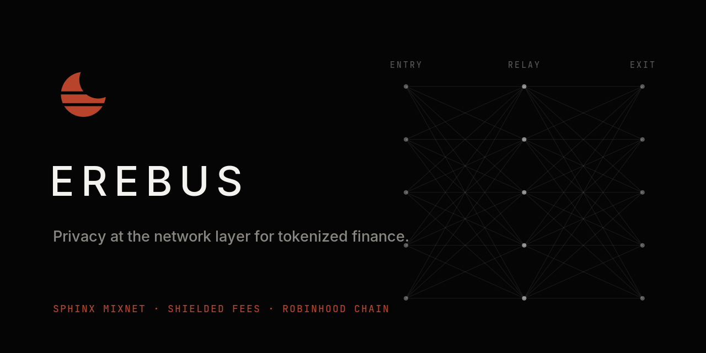
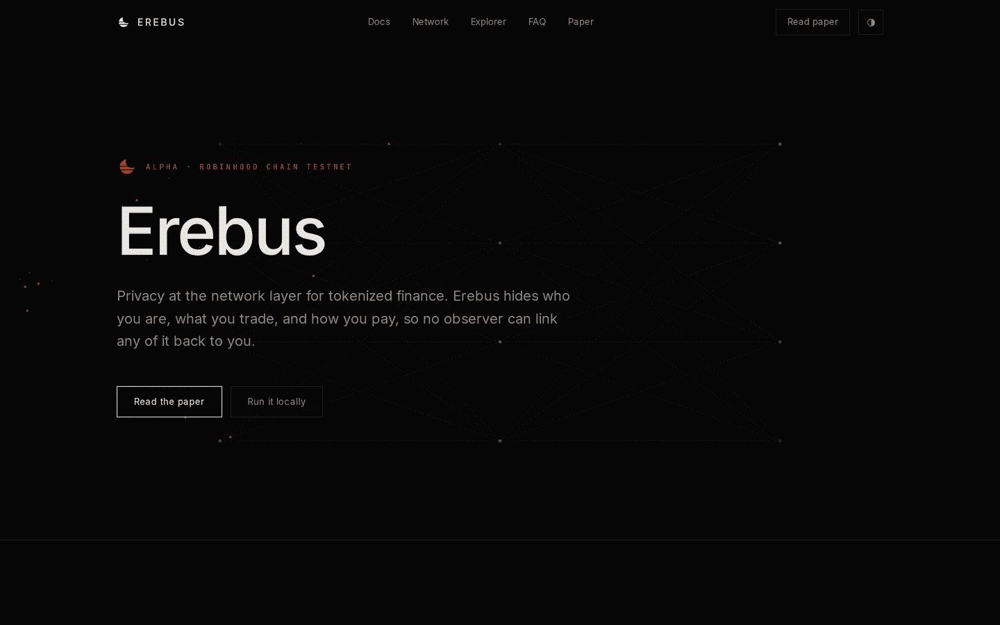
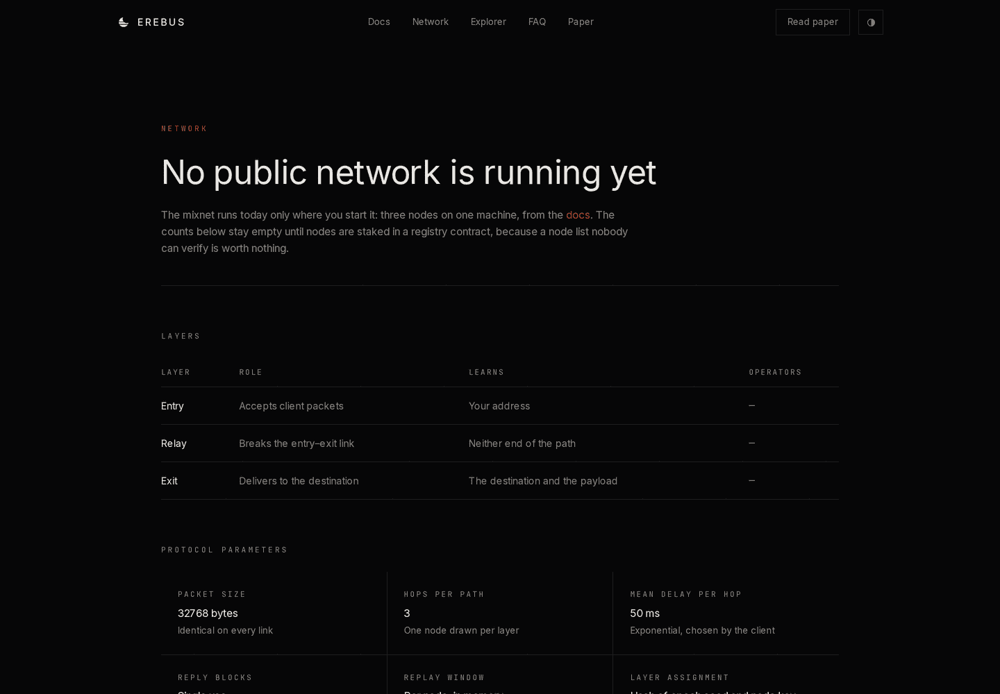
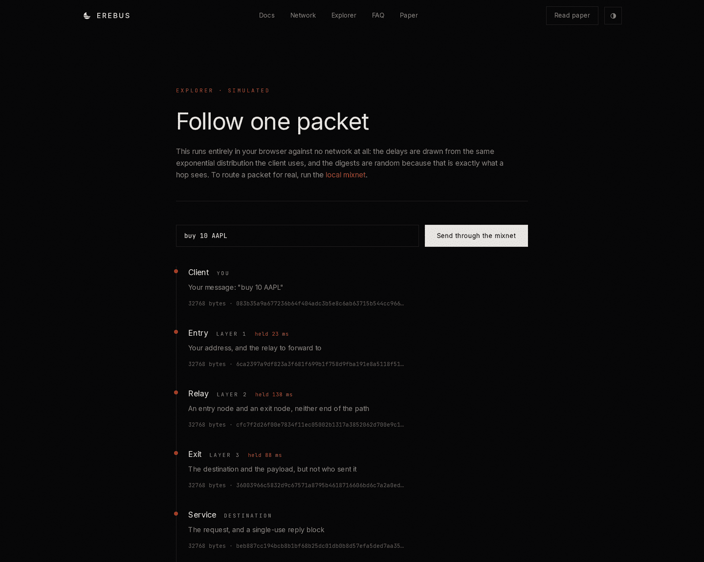
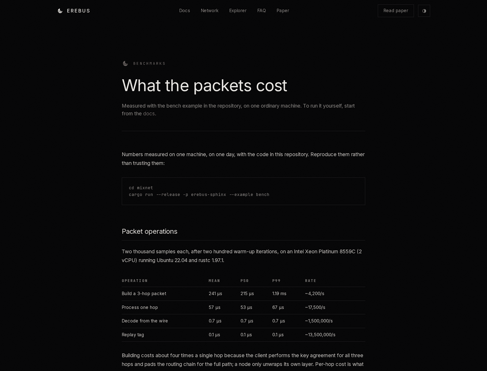

<p align="center">
  
</p>

<p align="center">
  Network-layer privacy for tokenized finance on
  <a href="https://docs.robinhood.com/chain/">Robinhood Chain</a>.
  <br>
  <a href="https://erebus-ten.vercel.app">Site</a> ·
  <a href="https://erebus-ten.vercel.app/paper">Paper</a> ·
  <a href="https://erebus-ten.vercel.app/docs">Docs</a> ·
  <a href="https://erebus-ten.vercel.app/benchmarks">Benchmarks</a> ·
  <a href="https://x.com/Erebusorg">@Erebusorg</a>
</p>

---

## Why

A stock token is an ERC-20, so a position is legible to anyone, sitting next to
an address that also receives a salary. Shielding transaction *contents* is not
enough. The transport layer still leaks an IP, a timing pattern, and an RPC read
history rich enough to rebuild the portfolio: the RPC provider knows which
balances a wallet keeps checking, and a passive observer knows which IP is
active seconds before a trade lands.

Erebus removes the link between a person and a transaction at the layer where it
is created. A client wraps its request in three layers of encryption, sends it
through three independently operated mix nodes, and each node peels exactly one
layer, holds the packet for a delay it cannot choose, and forwards it. Every
packet is the same 32 KB and no field survives a hop, so the traffic a node sees
on its way in cannot be matched with the traffic going out.

|  | Entry | Relay | Exit |
| --- | --- | --- | --- |
| Your IP | yes | no | no |
| Destination | no | no | yes |
| Payload | no | no | yes |
| That two packets are yours | no | no | no |

No single node learns both who you are and what you did, and it takes all three
colluding to change that.

## Status

The transport layer is implemented and runs on one machine today. The registry
contract, the shielded fee pool, and the browser SDK are not, and no public
network is running.

| Piece | State |
| --- | --- |
| Sphinx packet format, three layers, per-hop delay | done — [`mixnet/`](mixnet/) |
| Reply blocks, cover traffic, loop probes, replay rejection | done |
| Local three-node network on loopback | done |
| Registry contract, stake, slashing | not started |
| Shielded fee payment (ZK) | not started |
| Rust→WASM SDK and EIP-1193 provider | not started |
| Public fleet, audit, mainnet, token | none |

## The site

Eleven pages, no analytics, no cookies, no third-party scripts.

| | |
| --- | --- |
|  |  |
| **Landing** — what it does and what it deliberately does not hide. | **Network** — the layer table stays empty on purpose: until nodes are staked in a contract, a node list is something we could type rather than something you can verify. |
|  |  |
| **Explorer** — follow one packet through three hops. It runs entirely in your browser against no network, because a live traffic map would publish the timing correlations a mixnet exists to destroy. | **Benchmarks** — measured with `cargo run --release -p erebus-sphinx --example bench`, machine named on the page, not asserted. |

## Numbers

From the bench example on a 2-vCPU cloud machine, reproduce them rather than
trusting them:

| Operation | Mean | p50 | Rate |
| --- | --- | --- | --- |
| Build a 3-hop packet | 241 µs | 215 µs | ~4,200/s |
| Process one hop | 57 µs | 53 µs | ~17,500/s |
| Decode from the wire | 0.7 µs | 0.7 µs | ~1,500,000/s |
| Replay tag | 0.1 µs | 0.1 µs | ~13,500,000/s |

Seventeen thousand hops per second per core, at 32 KB a packet, is far more than
the link under it can carry: **a mix node is bound by bandwidth, not by
cryptography.** End-to-end latency is the mixing delay we ask for on purpose —
a faster mixnet carrying the same traffic is a weaker one.

## Run it

The website:

```bash
npm install
npm run dev          # http://localhost:3000
npm run build
npm run lint
```

Three mix nodes, a destination service, and a real packet through all three
hops, on loopback:

```bash
cd mixnet
cargo test
./scripts/local-network.sh "buy 10 AAPL"
cargo run --release -p erebus-sphinx --example bench
```

See [`mixnet/README.md`](mixnet/README.md) for running the pieces by hand and
for the list of known gaps in the transport layer.

## Layout

```
content/whitepaper.md    the specification — single source of truth, rendered at /paper
content/docs.md          how to run the mixnet, rendered at /docs
content/benchmarks.md    measured numbers, rendered at /benchmarks
src/app/                 pages: landing, paper, docs, network, explorer, faq,
                         benchmarks, brand, privacy, terms, content policy
src/components/          nav, footer, theme toggle, mixnet backdrop, packet explorer
mixnet/crates/sphinx     the packet format
mixnet/crates/topology   registry, layer assignment, path selection, delays
mixnet/crates/node       peel, hold, forward
mixnet/crates/client     path selection, reply blocks, probes, cover traffic
public/brand/            logo and cover, generated by scripts/brand.py
```

## Brand

The mark is an eclipse cut into three bands: the disc is still there, almost
none of it is legible, and what is left is the three mix layers. The assets are
generated — edit `scripts/brand.py` and re-run it rather than editing them:

```bash
python3 scripts/brand.py
```

It writes the mark, the accent icon, the wordmark, the cover
(`public/brand/erebus-cover.png`, sized for GitHub's social preview, which has
to be uploaded in repository settings by hand), `src/app/icon.svg`,
`src/app/apple-icon.png`, and `src/app/opengraph-image.png`. Set
`NEXT_PUBLIC_SITE_URL` in the deployment so the OG image resolves absolutely.

## Caveats

Unaudited alpha. No mainnet deployment, no token, no sale. Robinhood Chain is a
trademark of its owner; Erebus is unaffiliated.
